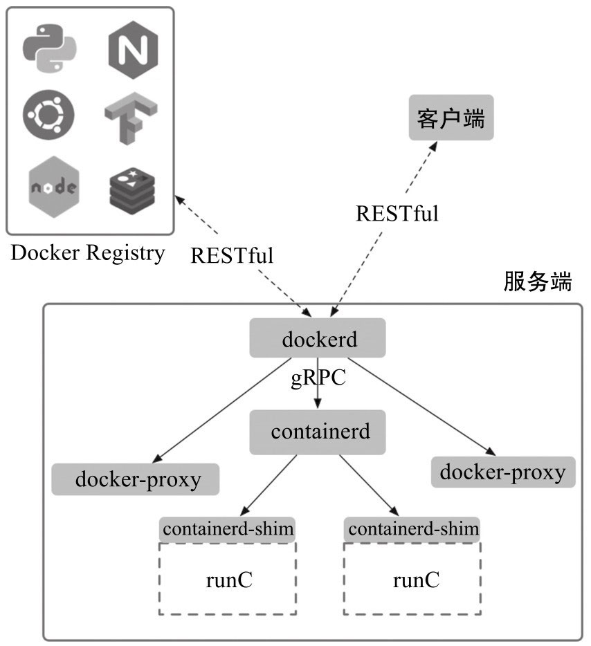

# 1.4 基本架构

Docker目前采用了标准的<mark style="color:blue;">**C/S架构**</mark>，包括**客户端**、**服务端**两大核心组件，同时通过**镜像仓库**来存储镜像。客户端和服务端既可以运行在一个机器上，也可通过socket或者RESTful API来进行通信。

## 1. 服务端

服务端主要包括四个组件：

* **dockerd**：**为客户端提供RESTful API，响应来自客户端的请求**，采用模块化的架构，通过专门的Engine模块来分发管理各个来自客户端的任务。
* **docker-proxy**：是dockerd的子进程，**当需要进行容器端口映射时，docker-proxy完成网络映射配置。**
* **containerd**：是dockerd的子进程，提供gRPC接口响应来自dockerd的请求，对下管理runC镜像和容器环境。
* **containerd-shim**：是containerd的子进程，为runC容器提供支持，同时作为容器内进程的根进程。

<figure><figcaption></figcaption></figure>


**runC**是从Docker公司开源的**libcontainer**项目演化而来的，目前作为一种具体的开放容器标准实现加入**Open Containers Initiative（OCI）**。

runC已经支持了Linux系统中容器相关技术栈，同时正在实现对其他操作系统的兼容。用户可以通过使用**docker-runc**命令来直接使用OCI规范的容器。



**dockerd**默认监听本地的**unix:///var/run/docker.sock**套接字，<mark style="color:blue;">**只允许本地的root用户或docker用户组成员访问**</mark>。

可以通过 **-H** 选项来修改监听的方式。例如，让dockerd监听本地的TCP连接1234端口：

```bash
$ sudo dockerd -H 127.0.0.1:1234
```



<mark style="color:blue;">**docker-proxy只有当启动容器并且使用端口映射时候才会执行**</mark>，负责配置容器的端口映射规则。


## 2. 客户端

Docker客户端为用户提供一系列可执行命令，使用这些命令可实现与Docker服务端交互。

客户端默认通过本地的**unix:///var/run/docker.sock**套接字向服务端发送命令。**如果服务端没有监听在默认的地址，则需要客户端在执行命令的时候显式地指定服务端地址。**例如，假定服务端监听在本地的TCP连接1234端口为tcp://127.0.0.1:1234，只有通过-H参数指定了正确的地址信息才能连接到服务端：

```bash
$ docker -H 127.0.0.1:1234 info
Client: Docker Engine - Community
 Version:    24.0.6
 Context:    default
 Debug Mode: false
 Plugins:
  buildx: Docker Buildx (Docker Inc.)
    Version:  v0.11.2
    Path:     /usr/libexec/docker/cli-plugins/docker-buildx
  compose: Docker Compose (Docker Inc.)
    Version:  v2.21.0
    Path:     /usr/libexec/docker/cli-plugins/docker-compose

Server:
 Containers: 3
  Running: 0
  Paused: 0
  Stopped: 3
 Images: 9
 Server Version: 24.0.6
 Storage Driver: overlay2
  Backing Filesystem: xfs
  Supports d_type: true
  Using metacopy: false
  Native Overlay Diff: true
  userxattr: false
 Logging Driver: json-file
 Cgroup Driver: cgroupfs
 Cgroup Version: 1
 Plugins:
  Volume: local
  Network: bridge host ipvlan macvlan null overlay
  Log: awslogs fluentd gcplogs gelf journald json-file local logentries splunk syslog
 Swarm: inactive
 Runtimes: io.containerd.runc.v2 runc
 Default Runtime: runc
 Init Binary: docker-init
 containerd version: 61f9fd88f79f081d64d6fa3bb1a0dc71ec870523
 runc version: v1.1.9-0-gccaecfc
 init version: de40ad0
 Security Options:
  seccomp
   Profile: builtin
 Kernel Version: 3.10.0-1160.el7.x86_64
 Operating System: CentOS Linux 7 (Core)
 OSType: linux
 Architecture: x86_64
 CPUs: 8
 Total Memory: 7.62GiB
 Name: k8s
 ID: f9c378bf-5ed2-41d5-89bc-d58b2cae6a36
 Docker Root Dir: /var/lib/docker
 Debug Mode: false
 Experimental: false
 Insecure Registries:
  192.168.10.110:5000
  127.0.0.0/8
 Registry Mirrors:
  https://v486v7xx.mirror.aliyuncs.com/
 Live Restore Enabled: false

WARNING: API is accessible on http://127.0.0.1:1234 without encryption.
         Access to the remote API is equivalent to root access on the host. Refer
         to the 'Docker daemon attack surface' section in the documentation for
         more information: https://docs.docker.com/go/attack-surface/
```

## 3.镜像仓库

**Docker使用镜像仓库（Registry）在大规模场景下存储和分发Docker镜像。**镜像仓库提供了对不同存储后端的支持，存放镜像文件，并且**支持RESTful API**，接收来自dockerd的命令，包括**拉取**、**上传**镜像等。
