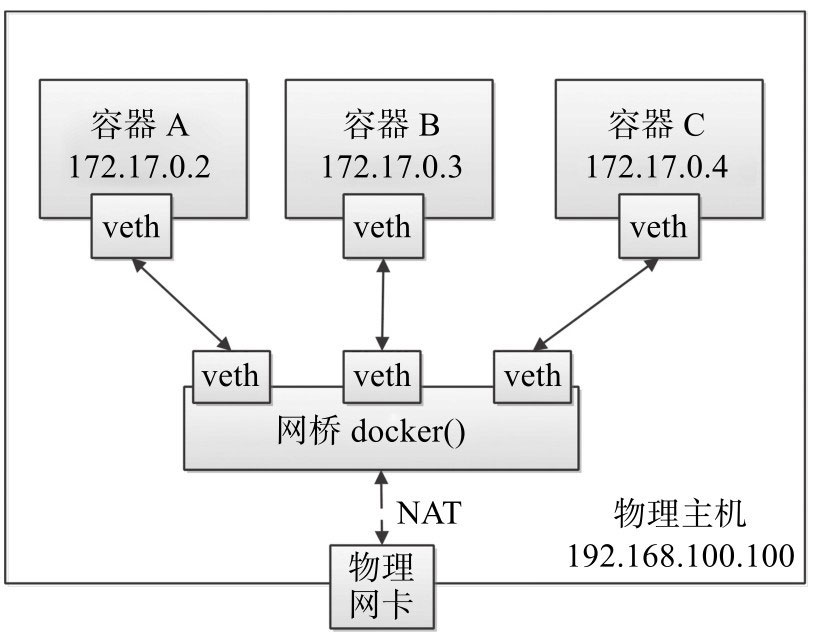

# 1.6 网络虚拟化

Docker的本地网络实现其实就是利用了Linux上的**网络命名空间**和**虚拟网络设备**（特别是veth pair）。

## 1. 基本原理

Docker中的网络接口默认都是**虚拟接口**。虚拟接口的最大优势就是转发效率极高。这是因为**Linux通过在内核中进行数据复制来实现虚拟接口之间的数据转发**，即**发送接口的发送缓存中的数据包将被直接复制到接收接口的接收缓存中，而无须通过外部物理网络设备进行交换**。对于本地系统和容器内系统来看，虚拟接口跟一个正常的以太网卡相比并无区别，只是它的速度要快得多。

Docker容器网络就很好地利用了Linux虚拟网络技术，它**在本地主机和容器内分别创建一个虚拟接口veth，并连通（这样的一对虚拟接口叫做veth pair）**，如图所示**：**

<figure><figcaption></figcaption></figure>

## 2. 网络创建过程

一般情况下，Docker创建一个容器的时候，会具体执行如下操作：

1. 创建一对虚拟接口，分别放到本地主机和新容器的命名空间中；
2. 本地主机一端的虚拟接口连接到默认的**docker0网桥**或指定网桥上，并具有一个以veth开头的唯一名字，如veth1234；
3. 容器一端的虚拟接口将放到新创建的容器中，并修改名字作为**eth0**。这个接口只在容器的命名空间可见；
4. 从网桥可用地址段中获取一个空闲地址分配给容器的eth0（例如172.17.0.2/16），并配置默认路由网关为docker0网卡的内部接口docker0的IP地址（例如172.17.42.1/16）。

完成这些之后，容器就可以使用它所能看到的eth0虚拟网卡来连接其他容器和访问外部网络。


在使用**docker \[container] run**命令启动容器的时候，可以通过**--net**参数来指定容器的网络配置。有5个可选值**bridge**、**none**、**container**、**host**和**用户定义的网络**：

* \--net=bridge：默认值，在Docker网桥docker0上为容器创建新的网络栈；
* \--net=none：让Docker将新容器放到隔离的网络栈中，但是不进行网络配置。之后，用户可以自行配置；
* \--net=container:NAME\_or\_ID：让Docker将新建容器的进程放到一个已存在容器的网络栈中，新容器进程有自己的文件系统、进程列表和资源限制，但会和已存在的容器共享IP地址和端口等网络资源，两者进程可以直接通过lo环回接口通信；
* \--net=host：告诉Docker不要将容器网络放到隔离的命名空间中，即不要容器化容器内的网络。此时容器使用本地主机的网络，它拥有完全的本地主机接口访问权限。容器进程跟主机其他root进程一样可以打开低范围的端口，可以访问本地网络服务（比如D-bus），还可以让容器做一些影响整个主机系统的事情，比如重启主机。因此**使用这个选项的时候要非常小心**。如果进一步使用--privileged=true参数，容器甚至会被允许直接配置主机的网络栈；
* \--net=user\_defined\_network：用户自行用**network**相关命令创建一个网络，之后将容器连接到指定的已创建网络上去。

