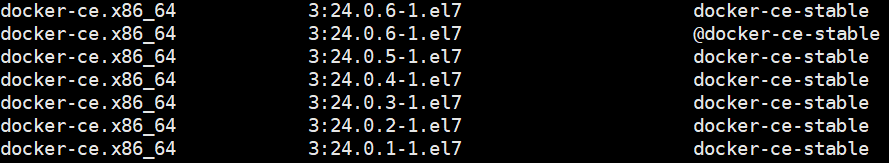

# 2.1 安装Docker Engine


以下内容为官方文档上的简述版本，详细内容请参考官方文档：

[https://docs.docker.com/engine/install/centos/](https://docs.docker.com/engine/install/centos/)


## 1. 卸载老的版本

```bash
sudo yum remove docker \
                  docker-client \
                  docker-client-latest \
                  docker-common \
                  docker-latest \
                  docker-latest-logrotate \
                  docker-logrotate \
                  docker-engine
```

当卸载Docker时，存放在 `/var/lib/docker/` 中的镜像（images）、容器（containers）、卷（volumes）以及网络（networks）并不会被自动移除。

## 2. 设置yum的repository


```bash
sudo yum install -y yum-utils
sudo yum-config-manager --add-repo https://download.docker.com/linux/centos/docker-ce.repo
```


## 3. 安装Engine




```bash
sudo yum install -y docker-ce docker-ce-cli containerd.io docker-buildx-plugin docker-compose-plugin
```




首先，列出所有可用的版本：

```bash
sudo yum list docker-ce --showduplicates | sort -r
```

<figure><figcaption></figcaption></figure>

&#x20;然后，执行以下命令安装指定版本的Engine，将命令中的\<VERSION\_STRING>替换为特定的版本号即可，版本号为上图中的第二列，如：3:24.0.6-1.el7。


```bash
sudo yum install -y docker-ce-<VERSION_STRING> docker-ce-cli-<VERSION_STRING> containerd.io docker-buildx-plugin docker-compose-plugin
```




## 4. 启动docker

```bash
sudo systemctl start docker
sudo systemctl enable docker
```

## 5. 镜像加速

登录阿里云 -> 选择容器镜像服务 -> 镜像加速器 -> 配置镜像加速器 -> 复制命令并执行。

检查镜像配置是否成功：

```bash
docker info
```

```bash
Client: Docker Engine - Community
 Version:    24.0.6
 Context:    default
 Debug Mode: false
 Plugins:
  buildx: Docker Buildx (Docker Inc.)
    Version:  v0.11.2
    Path:     /usr/libexec/docker/cli-plugins/docker-buildx
  compose: Docker Compose (Docker Inc.)
    Version:  v2.21.0
    Path:     /usr/libexec/docker/cli-plugins/docker-compose

Server:
 Containers: 5
  Running: 0
  Paused: 0
  Stopped: 5
 Images: 2
 Server Version: 24.0.6
 Storage Driver: overlay2
  Backing Filesystem: xfs
  Supports d_type: true
  Using metacopy: false
  Native Overlay Diff: true
  userxattr: false
 Logging Driver: json-file
 Cgroup Driver: cgroupfs
 Cgroup Version: 1
 Plugins:
  Volume: local
  Network: bridge host ipvlan macvlan null overlay
  Log: awslogs fluentd gcplogs gelf journald json-file local logentries splunk syslog
 Swarm: inactive
 Runtimes: io.containerd.runc.v2 runc
 Default Runtime: runc
 Init Binary: docker-init
 containerd version: 61f9fd88f79f081d64d6fa3bb1a0dc71ec870523
 runc version: v1.1.9-0-gccaecfc
 init version: de40ad0
 Security Options:
  seccomp
   Profile: builtin
 Kernel Version: 3.10.0-1160.el7.x86_64
 Operating System: CentOS Linux 7 (Core)
 OSType: linux
 Architecture: x86_64
 CPUs: 8
 Total Memory: 7.62GiB
 Name: k8s
 ID: f9c378bf-5ed2-41d5-89bc-d58b2cae6a36
 Docker Root Dir: /var/lib/docker
 Debug Mode: false
 Experimental: false
 Insecure Registries:
  127.0.0.0/8
 Registry Mirrors:
  https://v486v7xx.mirror.aliyuncs.com/
 Live Restore Enabled: false
```

## 5. 验证

```bash
sudo docker run hello-world
```

上述命令下载了一个测试镜像，并基于该镜像启动了一个容器。容器会打印出一行信息，然后退出。
