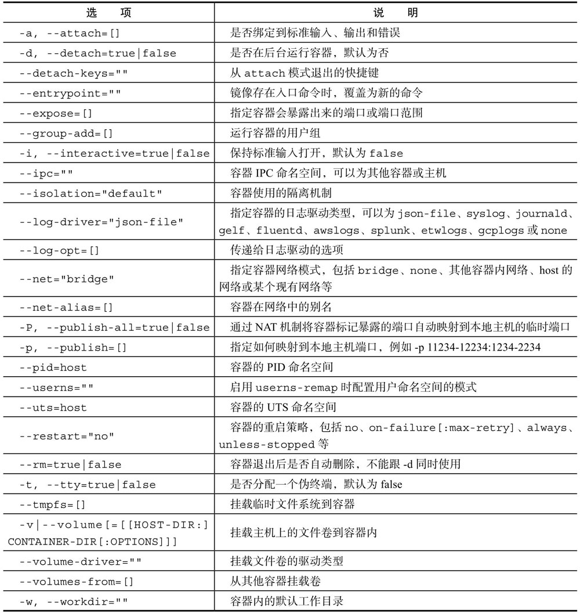
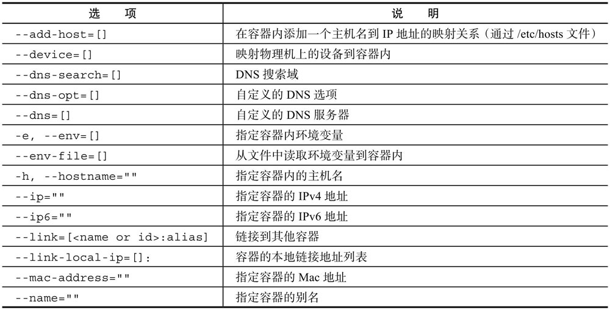
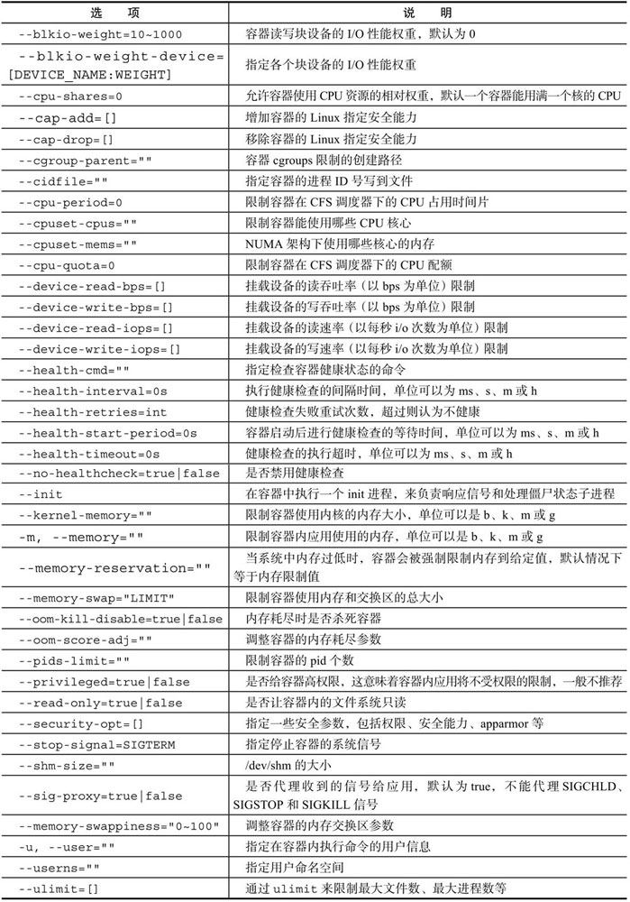

# 4.1 新建容器(create)

可以使用<mark style="color:blue;">**docker \[container] create**</mark>命令新建一个容器：


```bash
$ docker create -it --name="ubuntu-test" ubuntu:latest 
ff54c8b7640308b086b5fdd136ac6491a36bf1f3db096df848ac5d4d3ad8f302

$ docker ps -a
CONTAINER ID   IMAGE           COMMAND       CREATED              STATUS                   PORTS     NAMES
ff54c8b76403   ubuntu:latest   "bash"        4 seconds ago   Created                            ubuntu-test
```


使用**docker \[container] create**命令新建的容器处于停止状态，可以使用**docker \[container] start**命令来启动它。

由于容器是整个Docker技术栈的核心，create命令和后续的run命令支持的选项都十分复杂，需要在实践中不断去体会和熟悉。

选项主要包括如下三大类：

*   **与容器运行模式相关**


    <figure><figcaption><p><mark style="color:red;"><strong>与运行模式相关的选项</strong></mark></p></figcaption></figure>
*   **与容器环境配置相关**


    <figure><figcaption><p><mark style="color:red;"><strong>与容器环境配置相关</strong></mark></p></figcaption></figure>
*   **与容器资源限制和安全保护相关**


    <figure><figcaption><p><mark style="color:red;"><strong>与容器资源限制和安全保护相关的选项</strong></mark></p></figcaption></figure>
* **其他**
  * \-l, --label=\[]：以键值对方式指定容器的标签信息
  * \--label-file=\[]：从文件中读取标签信息


在生产环境中，为了提高容器的高可用性和安全性，一方面要**合理使用资源限制参数来管理容器的资源消耗**；另一方面要**指定合适的容器重启策略**，来自动重启退出的容器。此外，还可以使用**HAProxy等辅助工具来处理负载均衡，自动切换故障的应用容器**。

