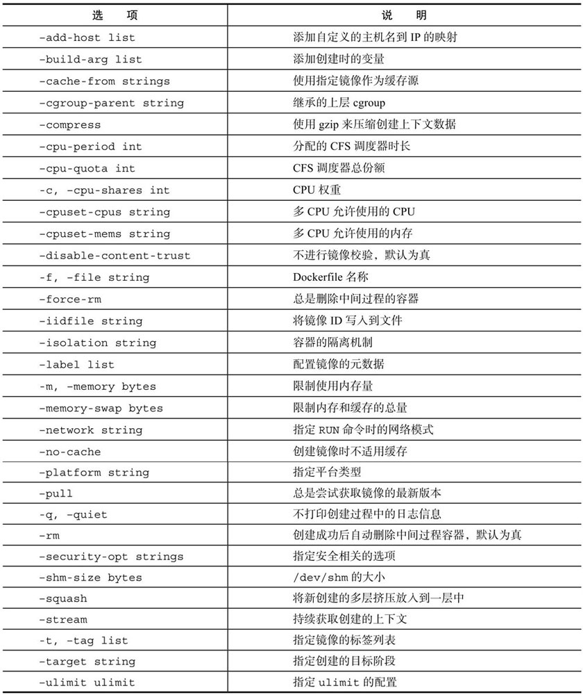
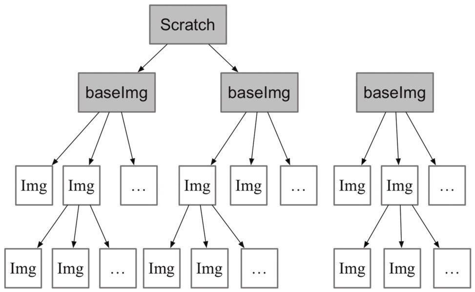

# 8.3 创建镜像

编写完成Dockerfile之后，可以通过<mark style="color:blue;">**docker \[image] build**</mark>命令来创建镜像。基本的格式为**docker build \[OPTIONS] PATH | URL | -**。

该命令将读取指定路径下（包括子目录）的Dockerfile，并**将该路径下所有数据作为上下文（Context）发送给Docker服务端**。Docker服务端在校验Dockerfile格式通过后，逐条执行其中定义的指令，碰到ADD、COPY和RUN指令会生成一层新的镜像。最终如果创建镜像成功，会返回最终镜像的ID。


<mark style="color:orange;">**如果上下文过大，会导致发送大量数据给服务端，延缓创建过程。因此除非是生成镜像所必需的文件，不然不要放到上下文路径下。**</mark>



如果使用非上下文路径下的Dockerfile，可以通过 **-f** 选项来指定其路径。

要指定生成镜像的标签信息，可以通过**-t** 选项。该选项可以重复使用多次为镜像一次添加多个名称。


## 1. 命令选项

<figure><figcaption></figcaption></figure>

## 2. 选择父镜像

**大部分情况下，生成新的镜像都需要通过FROM指令来指定父镜像**。父镜像是生成镜像的基础，会直接影响到所生成镜像的大小和功能。

用户可以选择两种镜像作为父镜像，一种是所谓的**基础镜像（baseimage）**，另外一种是**普通的镜像**（往往由第三方创建，基于基础镜像）。基础镜像比较特殊，其Dockerfile中往往不存在FROM指令，或者基于scratch镜像（FROM scratch），这意味着其在整个镜像树中处于根的位置。

<figure><figcaption></figcaption></figure>

## 3. 使用.dockerignore文件

可以通过<mark style="color:blue;">**.dockerignore**</mark>文件（每一行添加一条匹配模式）来**让Docker忽略匹配路径或文件，在创建镜像时候不将无关数据发送到服务端**。

.dockerignore文件中的模式语法支持**Golang**风格的路径正则格式：

* “\*”表示任意多个字符
* “? ”代表单个字符
* “! ”表示不匹配（即不忽略指定的路径或文件）

## 4. 多步骤创建

自17.05版本开始，Docker支持<mark style="color:blue;">**多步骤镜像创建（Multi-stage build）**</mark>特性，**可以精简最终生成的镜像大小。**

对于需要编译的应用（如C、Go或Java语言等）来说，通常情况下至少需要准备两个环境的Docker镜像：

* 编译环境镜像：包括完整的编译引擎、依赖库等，往往比较庞大。作用是编译应用为二进制文件；
* 运行环境镜像：利用编译好的二进制文件，运行应用，由于不需要编译环境，体积比较小。

使用多步骤创建，可以在保证最终生成的运行环境镜像保持精简的情况下，使用单一的Dockerfile，降低维护复杂度。
